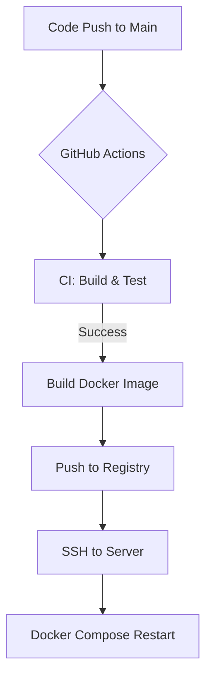

# 인프라 구축 계획: CI/CD 자동화 파이프라인

## 1. 배경 및 목적
개발자의 수동 배포 과정을 자동화하여 휴먼 에러를 방지하고, 코드 변경 사항을 신속하고 안정적으로 운영 환경에 반영하기 위함.

## 2. CI/CD 파이프라인 개요
- **CI (Continuous Integration)**: GitHub Actions를 통해 코드 빌드, 테스트, 린트 체크 자동화.
- **CD (Continuous Deployment)**: 빌드된 결과물을 Docker 이미지화하여 서버에 자동 배포.

## 3. GitHub Actions 워크플로우 설계

### 3.1 트리거 조건
- `main` 브랜치에 `push` 또는 `pull_request`가 merge될 때 수행.

### 3.2 CI 단계 (Build & Test)
1. **Repository Checkout**: 소스 코드 체크아웃.
2. **JDK & Node.js Setup**: 
   - Backend: Java 17 (Spring Boot)
   - Frontend: Node.js 20+ (Vite/React)
3. **Backend Build**: `./gradlew build` 수행 (테스트 코드 포함).
4. **Frontend Build**: `npm install` && `npm run build` 수행.
5. **Static Analysis**: ESLint 및 SonarQube(추후 확장) 연동.

## 4. Docker 기반 CD 전략

### 4.1 Docker 이미지 빌드 및 푸시
- **GitHub Packages (GHCR)** 또는 **Docker Hub**를 레지스트리로 사용.
- 이미지 태그 전략: `{branch}-{commit_sha}` 및 `latest`.

### 4.2 배포 흐름 (기본 전략)
1. CI 단계 성공 시 Docker 이미지 빌드.
2. 빌드된 이미지를 Registry에 `push`.
3. 운영 서버에 SSH 접속 후 `docker-compose pull` 및 `docker-compose up -d` 수행.

## 5. 파이프라인 구성도 (Draft)

## 6. 보안 및 설정 관리 (Secrets)

GitHub Repository Secrets에 다음 항목을 안전하게 저장하여 관리함:
- `DB_ROOT_PASSWORD`, `DB_PASSWORD`: 데이터베이스 접속 정보.
- `DOCKER_USERNAME`, `DOCKER_PASSWORD`: 레지스트리 인증 정보.
- `SERVER_SSH_KEY`: 서버 접속을 위한 개인키.
- `SERVER_IP`: 운영 서버 주소.

## 7. 향후 확장 계획
- **Blue-Green Deployment**: 무중단 배포 환경 구축.
- **Health Check**: 배포 후 애플리케이션 정상 작동 확인 자동화.
- **Slack 알림**: 배포 성공/실패 여부를 팀 채널에 공유.
